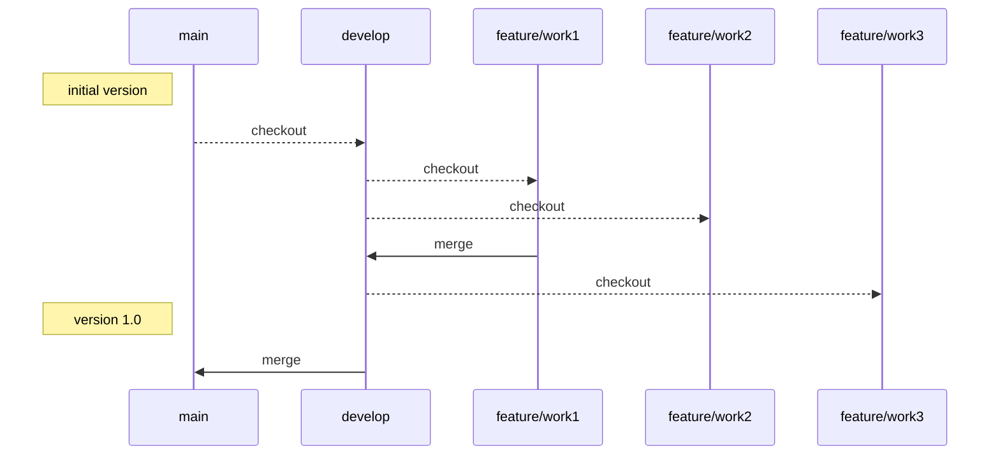

# automatic_extension

## Git branch 전략

- **main** - **develop** - **feature/~~** 세 branch로 운영.

## Code Style

### 1. naming rule
- 변수(variable) : **카멜 케이스** ex) curName, myName

- 클래스(class) : **파스칼 케이스** ex) Student, BandingMachine

- 함수(function) :  **스네이크 케이스** ex) get_host, make_user

## Library
## Environment
